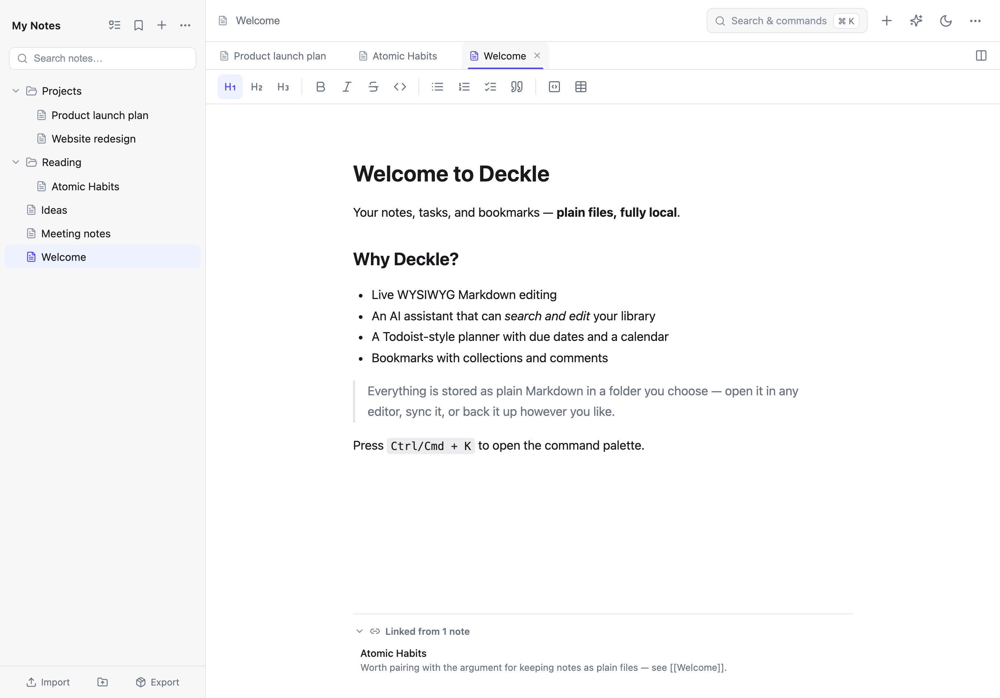
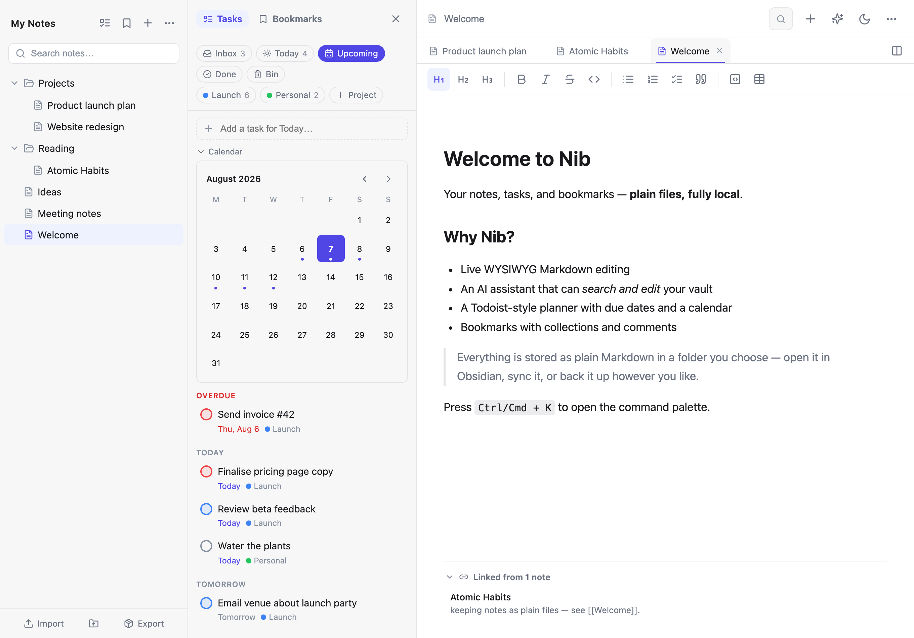
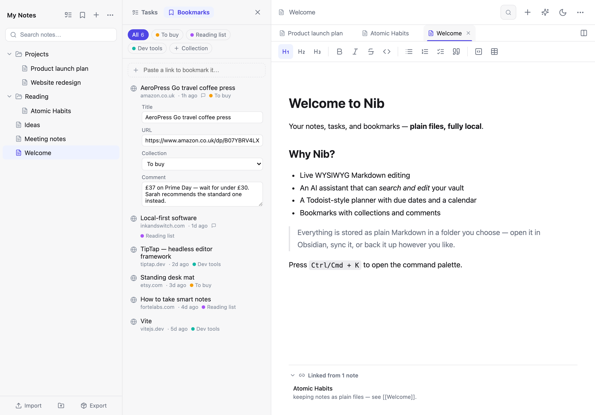
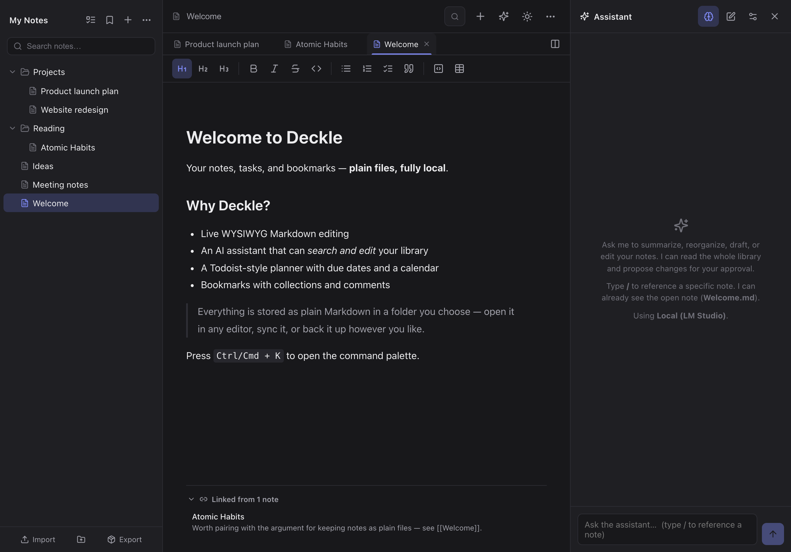
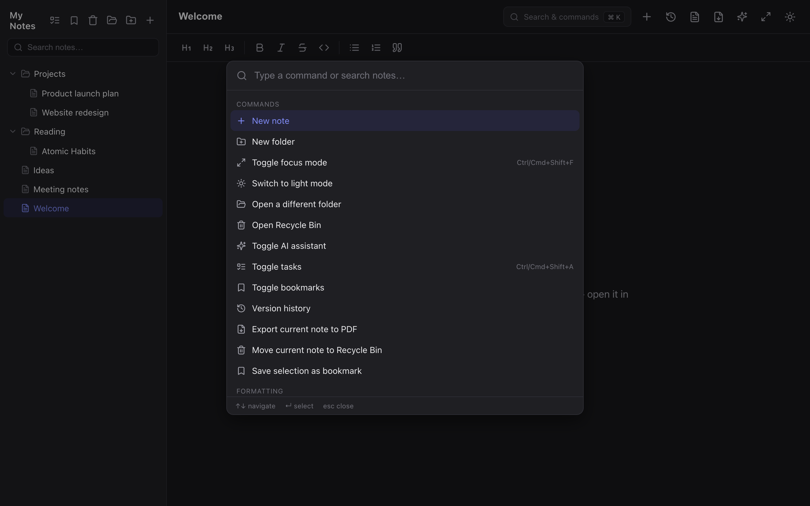

# Nib

**A clean, minimalist, web-based knowledge management platform.**

Markdown notes with live WYSIWYG editing, a Todoist-style task planner,
bookmarks with collections and comments, and an AI assistant that can search and
edit your knowledge base — plus a keyboard-driven command palette, light and
dark mode, and a fully responsive layout.

Everything lives as plain Markdown files, and you choose where: a folder on your
computer, Obsidian-style, or — if you self-host with Docker — a volume on your
own server, which makes Nib fully web based and leaves nothing on the device
you're using. No third-party account, no lock-in.



| Task planner — Inbox, Today, Upcoming with a mini calendar | Bookmarks — collections and per-bookmark comments |
| --- | --- |
|  |  |
| **AI assistant — search and edit your vault (dark mode)** | **Command palette — everything a keystroke away** |
|  |  |

## Why it exists

Note-taking apps ask you to choose between two bad options. The hosted ones are
polished but keep your notes in their database, on their terms, for as long as
they stay in business. The local ones keep your files but tie you to one
machine, or to a sync service you also have to trust.

Nib keeps the files as ordinary `.md` on disk — openable in Obsidian, syncable,
backed up by whatever you already use — while running entirely in the browser.
Self-host it and the same vault is reachable from a laptop, a phone or Safari
with nothing stored on the device.

The AI assistant follows the same principle: it can read and rewrite your whole
vault, but every change is shown as a diff you approve first, and your API keys
never leave your browser.

## What it does

- **Live WYSIWYG markdown** — type markdown (`# `, `**bold**`, `- list`) and it
  renders inline as you go (powered by TipTap / ProseMirror).
- **Local folder vault** — pick a folder and Nib reads and writes your notes
  there as real `.md` files. Open the same folder in Obsidian, sync it, or back
  it up — it's just Markdown on disk. (Chromium browsers; Safari and Firefox use
  private in-browser storage — see
  [Where your notes are stored](#where-your-notes-are-stored).)
- **Or a server vault** — self-host with Docker and your notes can live in a
  volume on your own server instead, password protected, reachable from any
  browser or device with nothing stored locally.
- **Folder tree** — browse nested subfolders, create folders, and
  **drag-and-drop** notes between them.
- **Command palette** — `Ctrl`/`Cmd`+`K` opens a fast, fully keyboard-driven
  palette for commands, formatting, and jumping to any note.
- **Search across the vault** — find notes by title, path, or file contents.
- **Tasks and planner** — a Todoist-style panel docked on the left: Inbox,
  Today, Upcoming (agenda and mini month calendar), projects, priorities
  (P1–P4), recurring tasks, a completed log, and a bin for deleted tasks
  (restorable, auto-purged after 30 days). Highlight text in a note and press
  `Ctrl`/`Cmd`+`Shift`+`A` to capture it as a task that links back to the note.
  Tasks live in a hidden `.nib/tasks.json` inside your vault, so they sync and
  back up with your notes.
- **Bookmarks** — save URLs, pages and products into coloured collections, each
  with its own comment box. Paste a link to add it, or select a link in a note
  and use the bookmark button — captured bookmarks link back to their source
  note. Stored in `.nib/bookmarks.json` in the vault.
- **Version history** — restore points are saved automatically: before every AI
  edit, periodically while you type, and before every restore. Open the clock
  icon to preview, restore or delete a note's earlier versions (kept in a hidden
  `.history` folder, 20 per note).
- **Recycle bin** — deleted notes move to a hidden `.trash` folder and can be
  restored or permanently removed.
- **AI assistant** — an optional right-side chat panel that can search and read
  your whole vault and create, edit, move or delete notes and folders. Every
  change is shown as a diff and must be approved before it runs. Ask questions
  about your notes and it finds and cites the relevant ones. Works with an
  Anthropic, OpenAI or [OpenRouter](https://openrouter.ai) API key, or fully
  locally via [LM Studio](https://lmstudio.ai). Reasoning models show a
  collapsible "Thought process"; API keys are stored only in your browser.
- **Semantic vault search (optional)** — enable embeddings in the assistant
  settings (OpenAI or a local LM Studio embedding model) and vault search
  matches by meaning, not just keywords. Vectors are cached locally and only
  changed notes are re-embedded; keyword (BM25) search always works without it.
- **Inline Ask AI** — highlight text and click the brain icon to improve, fix,
  shorten, summarise, explain, or run a custom prompt on just that passage, then
  Replace / Insert / Copy the result.
- **Quick formatting** — toolbar and floating selection menu for bold, italic,
  strikethrough, inline code, headings (H1–H3), lists and quotes.
- **Focus mode** — hide all chrome for distraction-free writing
  (`Ctrl`/`Cmd`+`Shift`+`F`, or `Esc` to exit).
- **Light and dark mode** — defaults to your system preference; choice persists.
- **Responsive** — desktop, tablet and mobile (collapsible note drawer).
- **Import** — drop `.md` files, or a whole folder of them, anywhere on the note
  tree; nested folders keep their structure and nothing is ever overwritten.
- **Export** — download a note as `.md`, export it to PDF via a clean print
  layout, or take the whole knowledge base as a ZIP: every note in its folder
  structure plus your tasks and bookmarks, optionally with the recycle bin and
  version history for a full backup.
- **REST API (optional)** — a token-authenticated API at `/api/v1` so an agent
  or script can search, read, write and organise your knowledge base, described
  by an OpenAPI 3.1 document the server publishes itself. See
  [API](#api).

## Where your notes are stored

Nib has three storage backends behind the same vault interface. Whichever you
use, your notes are ordinary `.md` files in an identical folder layout — so a
vault copied from a disk folder into the server's volume (or the other way
round) just works. Only the in-browser vault is awkward to copy, since it lives
in browser-managed storage rather than a folder you can open.

- **A folder on your computer** — **Chromium desktop browsers** (Chrome, Edge,
  Brave, Opera) use the
  [File System Access API](https://developer.mozilla.org/en-US/docs/Web/API/File_System_API):
  you pick a real folder on disk and your notes are ordinary files you can open
  in other apps, sync, or back up.
- **Privately in your browser** — **Safari and Firefox** fall back to the
  [Origin Private File System](https://developer.mozilla.org/en-US/docs/Web/API/File_System_API/Origin_private_file_system):
  notes are still real `.md` files, but they live in private browser storage on
  your device — not in a folder you can browse — because those browsers don't
  implement the folder picker.
- **On your own server** — when you self-host with Docker, notes are stored in a
  volume on the machine running Nib. The app then works from any browser,
  including Safari and mobile, and nothing is kept on the device you're using.

When a server vault is available, Nib asks which you want on first load; you can
switch later from the command palette (`Ctrl`/`Cmd`+`K`). Nothing is copied
between backends automatically.

## Run it

### With Docker (recommended)

Every push to `main` publishes a multi-arch (amd64 + arm64) image to GitHub
Container Registry, so deploying needs no source checkout and no local build.

```bash
curl -O https://raw.githubusercontent.com/authorTom/nib/main/compose.yaml
docker compose up -d          # pulls ghcr.io/authortom/nib:latest
```

Open **<http://localhost:8080>**.

The bundled `compose.yaml` **enables the server vault** and mounts a volume for
it, because that is the setup most people deploying Nib to a server actually
want. It starts with **no password** unless you set one — read
[Security](#security) before putting it anywhere reachable.

To change the host port, pin an image tag, or set the password, drop a `.env`
next to `compose.yaml` (Compose reads it automatically):

```bash
curl -O https://raw.githubusercontent.com/authorTom/nib/main/.env.example
mv .env.example .env          # then edit NIB_PORT / NIB_IMAGE / NIB_PASSWORD
```

Updating:

```bash
docker compose pull && docker compose up -d
```

**Running the image directly**, without compose. Note that the image itself
ships with the server vault **off**, so this is a static file server with notes
on your device:

```bash
docker run -d --name nib -p 8080:8080 --restart unless-stopped \
  ghcr.io/authortom/nib:latest

# ...or with a server vault:
docker run -d --name nib -p 8080:8080 --restart unless-stopped \
  -e NIB_SERVER_VAULT=true -e NIB_PASSWORD=a-long-passphrase \
  -v nib-vault:/data \
  ghcr.io/authortom/nib:latest
```

To build the image yourself rather than pull it, uncomment the `build:` block in
`compose.yaml` and run `docker compose up -d --build`.

### From source

```bash
npm install
npm run dev      # http://localhost:5173
npm run build    # type-check + production build to dist/
npm run preview  # preview the production build
```

On first run in a Chromium browser, click **Open folder** and choose a folder to
use as your vault — Nib remembers it for next time (you may be asked to re-grant
access on return). In Safari or Firefox, click **Get started** to create the
private in-browser vault.

To use the AI assistant, open the panel (sparkles icon) → settings (gear) and
pick a provider: Anthropic (Claude), OpenAI, OpenRouter, or a local LM Studio
server. Keys are kept in `localStorage` and sent only to the provider you chose.

There is also a containerised dev server, if you would rather not install Node:

```bash
docker compose --profile dev up dev   # → http://localhost:5173
```

That profile runs Vite alone, so the server vault isn't reachable from it and
Nib offers only the local backends. To develop against the server vault with hot
reload, run the API server next to Vite instead — `npm run dev` proxies `/api`
to `http://127.0.0.1:8080` (override with `NIB_API_TARGET`):

```bash
NIB_SERVER_VAULT=true NIB_VAULT_DIR=./vault node server/index.mjs &
npm run dev                           # → http://localhost:5173
```

## Configuration

Only relevant when the server vault is enabled.

| Variable | Default | What it does |
| --- | --- | --- |
| `NIB_SERVER_VAULT` | *(off)* | `true` enables the server vault |
| `NIB_PASSWORD` | *(none)* | Password for the vault. **Blank means no password at all** |
| `NIB_VAULT_NAME` | `My Notes` | Name shown in the app |
| `NIB_SESSION_SECRET` | *(random)* | Fixed cookie-signing key, so restarts don't sign everyone out |
| `NIB_SESSION_TTL_DAYS` | `30` | How long a sign-in lasts |
| `NIB_VAULT_DIR` | `/data` | Where the notes live inside the container |
| `NIB_API_TOKENS` | *(none)* | Bearer tokens for the [API](#api). Blank leaves it switched off |
| `NIB_API_CORS_ORIGINS` | *(none)* | Origins allowed to call `/api/v1` from a browser |
| `NIB_PORT` | `8080` | Host port (compose only) |

Everything else — theme, AI provider, embeddings — is set in the app itself.

On first load with a server vault available, pick **On this server** and enter
the password. To switch away later, open the command palette → *Sign out of the
server vault* (or *Leave the server vault* when no password is set). The same
entry reads *Switch to the server vault* when you're using a local one.

## API

Nib can expose the whole knowledge base over HTTP at `/api/v1`, so an agent can
search your notes, answer from them, write new ones, and file tasks and
bookmarks — everything the app can do, without a browser.

It is off until you configure a token, and it needs the **server vault**: a
local folder or in-browser vault lives on your device, where nothing outside
that browser can reach it.

```bash
# in .env, next to compose.yaml
NIB_SERVER_VAULT=true
NIB_API_TOKENS=hermes:rw:$(openssl rand -base64 32)
```

```bash
docker compose up -d
curl -H "Authorization: Bearer $TOKEN" http://localhost:8080/api/v1/health
```

Tokens are comma-separated. Each is either a bare secret (read-write) or
`name:scope:secret`, where scope is `r` or `rw`. Give every consumer its own, so
one can be revoked without disturbing the rest, and use `r` for anything that
only reads — a read-only token gets `403` on any write.

```bash
NIB_API_TOKENS=hermes:rw:SECRET_ONE,dashboard:r:SECRET_TWO
```

Every deployment publishes its own OpenAPI 3.1 description, so most agent
frameworks can generate tools from it rather than having them written by hand:

```bash
curl -H "Authorization: Bearer $TOKEN" http://localhost:8080/api/v1/openapi.json
```

The three calls that matter most for answering questions from a knowledge base:

```bash
# 1. Find the relevant notes (ranked, with snippets)
curl -H "Authorization: Bearer $TOKEN" \
  "http://localhost:8080/api/v1/search?q=latency+budget&limit=5"

# 2. Read one in full
curl -H "Authorization: Bearer $TOKEN" \
  "http://localhost:8080/api/v1/notes/Projects/idea.md"

# 3. Write what you learned back
curl -H "Authorization: Bearer $TOKEN" -H "Content-Type: application/json" \
  -X POST http://localhost:8080/api/v1/notes \
  -d '{"title":"Latency review","folder":"Projects","content":"# Latency review\n\n…"}'
```

### Endpoints

| Method | Path | What it does |
| --- | --- | --- |
| `GET` | `/health` | Liveness, and which vault is served |
| `GET` | `/openapi.json` | This API's OpenAPI 3.1 description |
| `GET` | `/notes` | List notes (`folder`, `limit`, `offset`, `sort`, `include_content`) |
| `POST` | `/notes` | Create a note; collisions get a numbered name rather than overwriting |
| `GET` | `/notes/{path}` | Read a note (`?format=markdown` for the raw file) |
| `PUT` | `/notes/{path}` | Create or replace a note |
| `PATCH` | `/notes/{path}` | `append` / `prepend` / `content`, or rename and move |
| `DELETE` | `/notes/{path}` | To the recycle bin (`?permanent=true` to erase) |
| `GET` | `/search` | BM25-ranked search with snippets (`q`, `limit`, `folder`) |
| `GET` | `/folders` | The folder and note tree |
| `POST` | `/folders` | Create a folder, including missing parents |
| `DELETE` | `/folders/{path}` | Delete a folder; its notes go to the recycle bin |
| `POST` | `/import` | Create up to 1000 notes in one call |
| `GET` | `/export` | The whole vault as a ZIP (`?include_hidden=true` for a full backup) |
| `GET` `POST` | `/tasks` | List (`filter=inbox\|today\|upcoming\|overdue\|completed`) or add |
| `GET` `PATCH` `DELETE` | `/tasks/{id}` | Read, edit, complete or bin a task |
| `GET` `POST` | `/projects` | Task projects |
| `GET` `POST` | `/bookmarks` | List and save bookmarks |
| `GET` `PATCH` `DELETE` | `/bookmarks/{id}` | Read, edit or delete a bookmark |
| `GET` `POST` | `/collections` | Bookmark collections |
| `GET` | `/history` | Version snapshots (`?path=` for one note) |
| `GET` | `/history/{snapshot}` | Read a snapshot's content |
| `POST` | `/history/{snapshot}/restore` | Restore a snapshot over its note |
| `GET` | `/trash` | What is in the recycle bin |
| `POST` | `/trash/{trashName}/restore` | Restore a deleted note |
| `DELETE` | `/trash/{trashName}` | Erase one recycle-bin item |

Paths are vault-relative with `/` separators — `Projects/idea.md` — and the
`.md` is added if you leave it off. Hidden dot folders are reserved by Nib and
rejected; `.trash`, `.history` and `.nib` have their own endpoints instead.
Errors are always `{ "error": { "code": …, "message": … } }` with a matching
HTTP status.

## How it's built

React · TypeScript · Vite · TipTap + tiptap-markdown (editor) · lucide-react
(icons) · @anthropic-ai/sdk (Claude; OpenAI-compatible providers via `fetch`).

The vault — a folder on disk, OPFS, or the server — is the source of truth for
notes; IndexedDB only remembers your chosen folder and caches search embeddings.
All three backends sit behind the browser's `FileSystemDirectoryHandle`
interface, so the rest of the app doesn't know or care which one is in use: the
server vault is an adapter ([`src/fs/remote.ts`](src/fs/remote.ts)) that
implements that same interface over HTTP.

The container's server ([`server/`](server/)) is plain Node with **no
dependencies** — only built-in modules — so there is nothing to audit or patch
beyond Node itself.

```
server/                    # Container runtime (Node built-ins only, no deps)
  index.mjs                # HTTP entry: routing, config, graceful shutdown
  vault-api.mjs            # Server vault file API (tree/read/write/mkdir/delete)
  vault-store.mjs          # Vault semantics server-side: trash, history, tasks…
  auth.mjs                 # Optional password gate + signed session cookies
  api.mjs                  # /api/v1 REST API for agents and scripts
  api-auth.mjs             # Bearer tokens for the API, with read-only scopes
  openapi.mjs              # The API's self-served OpenAPI 3.1 description
  search.mjs               # BM25 ranking behind GET /api/v1/search
  zip.mjs                  # Streaming ZIP writer behind GET /api/v1/export
  paths.mjs                # Vault path validation (traversal + symlink escapes)
  static.mjs               # Serves the built SPA: caching, gzip, security headers

src/
  App.tsx                  # Layout, theme, focus mode, modals, command palette
  fs/                      # Vault backends: disk, OPFS, remote; version history
  db/notes.ts              # IndexedDB store for the chosen folder handle
  ai/                      # Chat loop, providers, vault tools, retrieval, settings
  tasks/                   # Task state and persistence (.nib/tasks.json)
  bookmarks/               # Bookmark state and persistence (.nib/bookmarks.json)
  hooks/                   # Theme, notes tree, autosave, move, search, history
  components/              # Sidebar, editor, palette, assistant, panels, modals
  lib/                     # Markdown, PDF and ZIP export; Markdown import
  styles/                  # theme / global / editor / print CSS
```

## Security

Relevant when you enable the server vault.

- **One vault, one password.** Nib has no user accounts, so everyone who signs
  in shares the same notes.
- **A blank `NIB_PASSWORD` means no protection.** Anyone who can reach the port
  can read and write every note. That is only reasonable behind a VPN,
  Tailscale, or a reverse proxy that authenticates — the server logs a warning
  at startup when it happens.
- **How signing in works.** The password is checked in constant time and
  exchanged for a signed, `HttpOnly`, `SameSite=Strict` session cookie — it
  isn't stored in the browser and isn't sent again after sign-in. Repeated
  failures from one address are throttled (10 per 15 minutes). Sessions last
  `NIB_SESSION_TTL_DAYS`; if one expires while the app is open, Nib returns to
  the unlock screen rather than failing saves silently.
- **AI keys stay in your browser.** The server never sees them and never proxies
  AI requests.
- **API tokens are passwords.** A read-write token can read, rewrite and delete
  every note. Give each consumer its own so one can be revoked alone, and start
  anything new on a read-only (`r`) token until its behaviour looks sane.
  Rotating means editing `NIB_API_TOKENS` and restarting; there is no token
  store to clean up. Failed attempts are throttled (20 per 15 minutes).
- **The API and the app share a vault, not a login.** `/api/v1` ignores the
  session cookie and accepts only `Authorization: Bearer`. A browser never
  attaches that header on its own, so there is no CSRF surface and a stolen
  session cookie cannot reach the API.
- **Agent edits are as recoverable as yours.** Deleting through the API moves
  the note to the same recycle bin, and overwriting snapshots the replaced
  version into the same history — so a bad agent run is undone from the app's
  own dialogs rather than from a backup.

> **HTTPS matters in production.** The File System Access API and OPFS require a
> secure context — `http://localhost` is fine for local use, but anything served
> from another host must sit behind TLS (Caddy, Traefik, or nginx with
> certificates), or the local vault features won't be available. The server
> vault works without a secure context, but sends your password and session
> cookie in the clear, so it needs TLS just as much. The cookie is marked
> `Secure` automatically when the request arrives over HTTPS.

## Backing up

The quickest route is in the app: **Export** at the bottom of the sidebar (or
the command palette) downloads the whole knowledge base as a ZIP, with a tick
box to include the recycle bin and version history. That works on every backend,
including the in-browser vault that has no folder to copy. The API can do the
same thing unattended:

```bash
curl -H "Authorization: Bearer $TOKEN" -OJ \
  "http://localhost:8080/api/v1/export?include_hidden=true"
```

Otherwise your notes are just files:

```bash
docker run --rm -v nib-vault:/data -v "$PWD:/out" \
  alpine tar czf /out/nib-backup.tar.gz -C /data .
```

That includes the hidden `.nib` (tasks, bookmarks), `.history` and `.trash`
folders, so it is a complete vault. Or mount a host directory instead of the
named volume (`./notes:/data`, which must be writable by uid 1000) and point
Obsidian or your existing backup tool straight at it.

## Keyboard shortcuts

| Shortcut | Action |
| --- | --- |
| `Ctrl`/`Cmd` + `K` | Open the command palette |
| `Ctrl`/`Cmd` + `Shift` + `A` | Capture selection as a task / toggle the task panel |
| `Ctrl`/`Cmd` + `Shift` + `F` | Toggle focus mode |
| `Esc` | Close the topmost dialog / exit focus mode |

## Licence

MIT — see [LICENSE](LICENSE).
